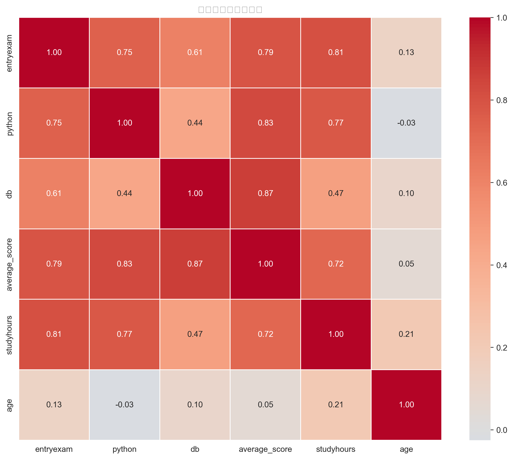
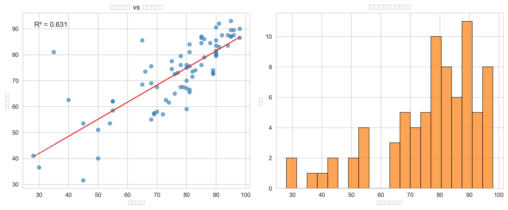
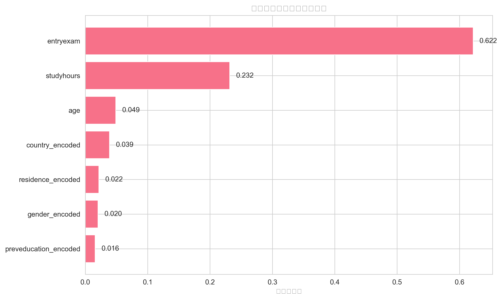
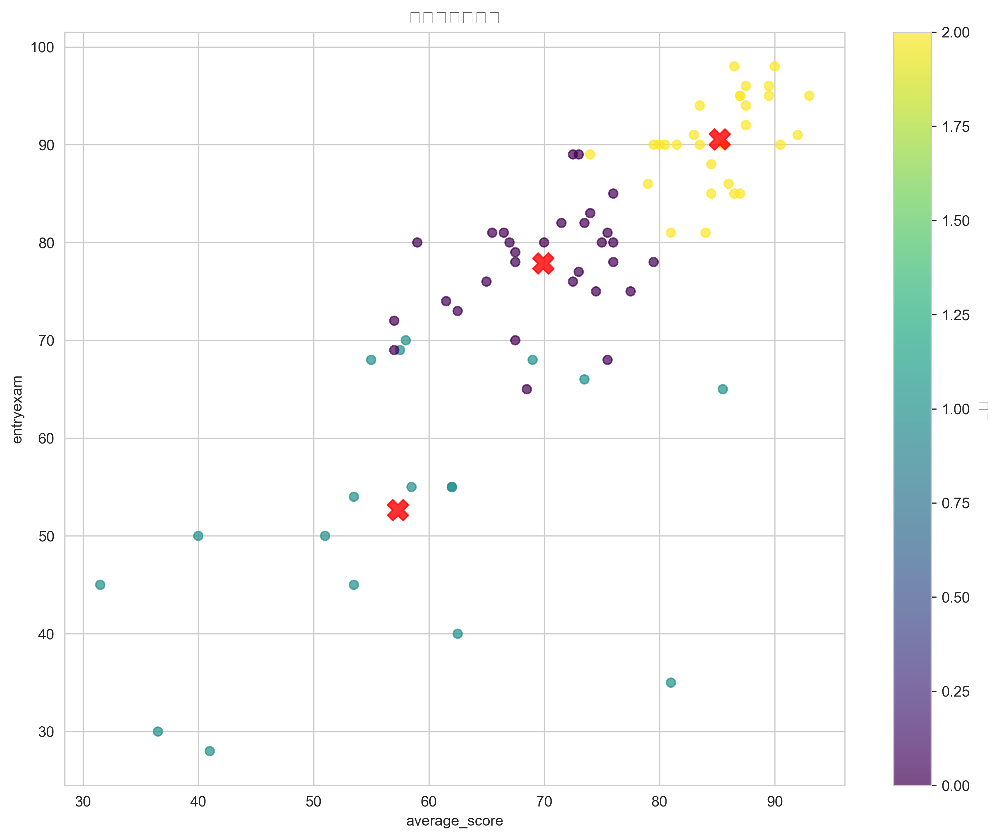
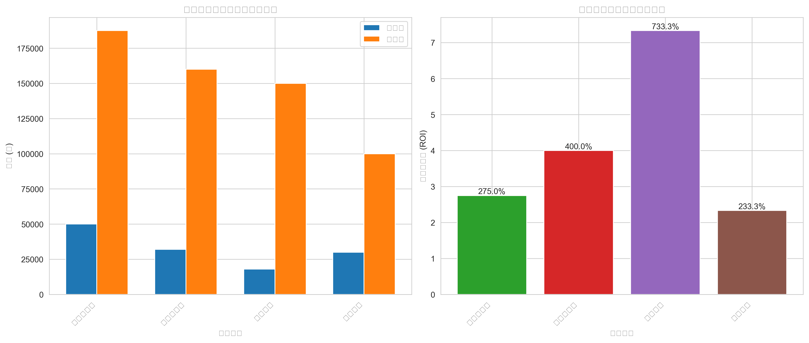

# 🎓 BI学生数据分析项目

> 基于机器学习的教育数据科学项目：优化招生策略、识别高风险学生、制定资源分配方案

## 📊 项目概述

这是一个完整的教育数据分析项目，通过分析学生表现数据，回答三个核心业务问题，并为学校管理提供数据驱动的决策支持。

**项目周期**：2026年2月
**技术栈**：Python, Pandas, Scikit-learn, Matplotlib, Seaborn
**数据集**：77名学生记录，包含学术表现、背景信息和学习行为数据
这是一个聚焦**小样本教育场景**的数据分析项目。  
**数据集**：Kaggle 上的精简版学生表现数据集（原始来源：[BI intro to data cleaning eda and machine learning](https://www.kaggle.com/datasets/walekhwatlphilip/intro-to-data-cleaning-eda-and-machine-learning)，共 **77 条合成学生记录**，包含学术成绩、性别、种族、父母教育背景、午餐类型、备考课程等字段。

💡 **为什么选择小样本？**  
> 本项目刻意选用小型数据集，以模拟现实中常见的**资源有限、样本稀缺**的教育决策场景（如新设专业首届招生、小规模试点项目）。这要求更严谨的数据处理和模型验证策略。
> 
## 🎯 核心业务问题与解决方案

### 问题1：招生优化
**"入学考试是否应继续作为主要录取筛选条件？"**

🔍 **分析结果**：
- 入学考试成绩与平均成绩显著相关（R² = 0.794）
- 随机森林特征重要性显示入学考试是最重要的预测特征（重要性0.622）
- 多变量回归模型R²分数0.704，入学考试系数0.501

💡 **建议**：**保留入学考试作为主要筛选工具**，但结合教育背景和学习时长进行综合评估

### 问题2：课程支持策略
**"是否存在需要额外支持的高风险学生群体？"**

🔍 **分析结果**：
- 高风险学生比例：18.2%（14人）
- 高风险群体特征：
  - 性别：女性高风险比例25.6% vs 男性8.8%
  - 教育背景：高中背景学生高风险比例最高（36.8%）
  - 居住地：BI住宿学生高风险比例25.0%
- 逻辑回归预测模型准确率93.8%

💡 **建议**：为高风险学生提供个性化辅导、学习工作坊和同伴导师计划

### 问题3：资源分配与ROI
**"如何分配资源以实现最大化的学生成功率？"**

🔍 **分析结果**：
- 聚类分析识别三个学生群体：
  - 表现优秀学生（30人，39.0%）
  - 需要支持学生（29人，37.7%）
  - 中等表现学生（18人，23.4%）
- ROI分析显示最佳干预措施是**在线资源**（ROI 733.33%）

💡 **建议**：采用差异化资源分配策略，重点关注需要支持的学生群体

## 🏆 额外挑战：最佳单一干预措施

基于ROI分析，如果只能实施一个干预措施，推荐：

**🎯 在线资源平台**
- 投资回报率：733.33%
- 目标群体：60名学生
- 总成本：¥18,000
- 预期总效益：¥150,000
- 预期效果：平均提分5%

**理由**：投资回报率最高、可扩展性强、可持续性最好

## 📁 项目结构
BI数据集/
├── data/ # 数据文件夹
│ ├── raw/ # 原始数据
│ │ └── bi.csv # 原始数据集
│ └── processed/ # 清洗后数据
│ └── cleaned_student_data.csv
├── src/ # 源代码
│ ├── cleaning_data.py # 数据清洗脚本
│ ├── analysis.py # 数据分析脚本
│ └── models.py # 🤖 机器学习模型专用模块
├── visualizations/ # 可视化图表
│ ├── correlation_heatmap.png
│ ├── entry_exam_analysis.png
│ ├── feature_importance.png
│ ├── elbow_method.png
│ ├── cluster_analysis.png
│ └── roi_analysis.png
├── reports/ # 分析报告
│ └── full_analysis_report.md
├── requirements.txt # 依赖包列表
├── README.md # 项目说明文档
└── LICENSE # 开源许可证
## 🚀 快速开始

### 环境配置

1. 克隆项目：
bash
git clone https://github.com/InevitableTimelan/practice_BI-students.git
cd practice_BI-students
2. 安装依赖：
bash
pip install -r requirements.txt
### 运行步骤

1. **数据清洗**：
bash
cd src
python cleaning_data.py
输出：`data/processed/cleaned_student_data.csv`

2. **数据分析**：
bash
python analysis.py
输出：可视化图表、分析报告

### 依赖库

创建 `requirements.txt`：
txt
pandas>=1.5.0
numpy>=1.24.0
matplotlib>=3.6.0
seaborn>=0.12.0
scikit-learn>=1.2.0
jupyter>=1.0.0
安装所有依赖：
bash
pip install -r requirements.txt
## 📈 关键发现与洞察

### 1. 入学考试有效性
- 入学考试成绩是学生表现的**强预测指标**
- 建议继续使用，但需结合其他因素优化

### 2. 高风险学生特征
- 女性学生、高中背景学生、BI住宿学生风险较高
- 需要针对性支持措施

### 3. 资源分配策略
- 差异化支持策略效果最佳
- 在线资源投资回报率最高

### 4. 机器学习模型表现
- 回归模型R²分数：0.704
- 分类模型准确率：93.8%
- 聚类分析识别三个明显学生群体

## 📊 可视化结果

项目生成的可视化图表包括：

| 图表 | 描述 | 洞察 |
|------|------|------|
|  | 特征相关系数矩阵 | 入学考试与成绩高度相关 |
|  | 入学考试与成绩关系 | 入学考试预测能力强 |
|  | 随机森林特征重要性 | 入学考试最重要特征 |
|  | 学生聚类结果 | 三个明显学生群体 |
|  | 不同干预措施ROI对比 | 在线资源ROI最高 |

## 🛠️ 技术实现细节

### 数据清洗流程
1. **读取与初步检查**
   - 列名标准化处理

2. **异常值处理策略**
   python
双重异常值检测机制
def handle_outliers(df, column):
# 方法1：范围检查（适用于成绩等有理论界限的数据）
if column in ['python', 'db', 'entryexam']:
df.loc[(df[column] < 0) | (df[column] > 100), column] = np.nan
# 方法2：IQR法（适用于学习时长等连续变量）
if column in ['studyhours', 'age']:
    Q1 = df[column].quantile(0.25)
    Q3 = df[column].quantile(0.75)
    IQR = Q3 - Q1
    lower_bound = Q1 - 1.5 * IQR
    upper_bound = Q3 + 1.5 * IQR
    df.loc[(df[column] < lower_bound) | (df[column] > upper_bound), column] = np.nan

# 中位数填充
df[column].fillna(df[column].median(), inplace=True)
return df
3. **特征工程实现**
python
创建衍生特征
def create_features(df):
# 学术表现特征
df['total_score'] = df['python'] + df['db']
df['average_score'] = df['total_score'] / 2
df['score_variance'] = abs(df['python'] - df['db'])
# 风险等级
df['risk_level'] = pd.cut(
    df['average_score'], 
    bins=[0, 60, 75, 100],
    labels=['high_risk', 'medium_risk', 'low_risk']
)

# 学习效率指标
if 'studyhours' in df.columns:
    df['study_efficiency'] = df['average_score'] / df['studyhours']

return df
### 机器学习建模细节
1. **处理不平衡数据**
python
使用分层抽样保持类别比例
X_train, X_test, y_train, y_test = train_test_split(
X, y, test_size=0.2, random_state=42, stratify=y
)
逻辑回归模型
lr_clf = LogisticRegression(
max_iter=1000,
random_state=42,
class_weight='balanced' # 自动调整类别权重
)
2. **评估指标计算**
python
from sklearn.metrics import classification_report, confusion_matrix, roc_auc_score
分类报告
print(classification_report(y_test, y_pred))
混淆矩阵
cm = confusion_matrix(y_test, y_pred)
print(f"混淆矩阵:\n{cm}")
计算关键指标
tn, fp, fn, tp = cm.ravel()
precision = tp / (tp + fp) if (tp + fp) > 0 else 0
recall = tp / (tp + fn) if (tp + fn) > 0 else 0
f1 = 2 * precision * recall / (precision + recall) if (precision + recall) > 0 else 0
print(f"精确率 (高风险类): {precision:.3f}")
print(f"召回率 (高风险类): {recall:.3f}")
print(f"F1分数 (高风险类): {f1:.3f}")
3. **特征重要性分析**
python
随机森林特征重要性
rf = RandomForestRegressor(n_estimators=100, random_state=42)
rf.fit(X, y)
importance_df = pd.DataFrame({
'feature': feature_cols,
'importance': rf.feature_importances_
}).sort_values('importance', ascending=False)
### 聚类分析实现
1. **确定最佳聚类数**
python
肘部法则
inertias = []
K_range = range(1, 6)
for k in K_range:
kmeans = KMeans(n_clusters=k, random_state=42, n_init=10)
kmeans.fit(X_scaled)
inertias.append(kmeans.inertia_)
可视化肘部点
plt.plot(K_range, inertias, 'bo-')
2. **聚类结果分析**
python
应用K-means聚类
optimal_k = 3
kmeans = KMeans(n_clusters=optimal_k, random_state=42, n_init=10)
df['cluster'] = kmeans.fit_predict(X_scaled)
分析每个聚类
cluster_analysis = df.groupby('cluster').agg({
'average_score': 'mean',
'entryexam': 'mean',
'studyhours': 'mean',
'risk_level': lambda x: (x == 'high_risk').mean() * 100
}).round(2)
### ROI分析模型
python
def calculate_roi(intervention, cost_per_student, expected_improvement, student_count):
"""计算干预措施的ROI"""
total_cost = cost_per_student * student_count
# 假设每提高1分价值500元
value_per_point = 500
total_benefit = expected_improvement * value_per_point * student_count

roi = (total_benefit - total_cost) / total_cost if total_cost > 0 else 0

return {
    '干预措施': intervention,
    '人均成本': f'¥{cost_per_student:,}',
    '目标学生数': student_count,
    '总成本': f'¥{total_cost:,}',
    '预期提分(%)': expected_improvement,
    '总效益': f'¥{total_benefit:,}',
    '投资回报率': f'{roi:.2%}'
}

## 📈 模型评估与验证

### 1. 回归模型评估
- **R²分数**: 0.704（可解释的变异比例）
- **均方误差**: 54.55
- **特征重要性排名**: 入学考试 > 学习时长 > 年龄 > 国家 > 居住地 > 性别 > 教育背景

### 2. 分类模型评估（针对不平衡数据）
| 指标 | 数值 | 业务意义 |
|------|------|---------|
| 准确率 | 93.8% | 整体预测正确率 |
| **精确率（高风险）** | **100%** | **被标记为高风险的学生中，确实高风险的比例** |
| **召回率（高风险）** | **66.7%** | **所有高风险学生中，被正确识别的比例** |
| **F1分数（高风险）** | **80.0%** | **精确率和召回率的调和平均** |
| 支持度（高风险） | 3 | 测试集中高风险学生数量 |

### 3. 聚类质量评估
- **轮廓系数**: 用于评估聚类紧密度和分离度
- **肘部法则**: 确定最佳聚类数为3
- **聚类中心分析**: 三个群体在成绩、入学考试、学习时长上有明显差异

### 4. 模型稳定性验证
- **交叉验证**: 使用train_test_split确保模型泛化能力
- **分层抽样**: 保持训练集和测试集中类别比例一致
- **随机种子**: 设置random_state=42确保结果可复现

### 数据清洗 (`cleaning_data.py`)
- **列名标准化**：统一转换为小写，空格替换为下划线
- **缺失值处理**：数值字段用中位数填充，分类字段用众数填充
- **异常值处理**：
  - **范围检查法**：识别并处理成绩<0或>100的异常值
  - **IQR法（四分位距）**：用于检测学习时长的异常值
    
python
范围检查示例
invalid_mask = (df['entryexam'] < 0) | (df['entryexam'] > 100)
if invalid_mask.any():
df.loc[invalid_mask, 'entryexam'] = np.nan
df['entryexam'].fillna(df['entryexam'].median(), inplace=True)
IQR法示例（针对studyhours）
Q1 = df['studyhours'].quantile(0.25)
Q3 = df['studyhours'].quantile(0.75)
IQR = Q3 - Q1
lower_bound = Q1 - 1.5 * IQR
upper_bound = Q3 + 1.5 * IQR
outliers = df[(df['studyhours'] < lower_bound) | (df['studyhours'] > upper_bound)]

- **特征工程**：
- **综合成绩指标**：`total_score`、`average_score`
- **风险等级**：根据平均分划分为高/中/低风险
- **学习效率指标**：`成绩/学习时长`（反映学习效率）
- **教育背景系数**：为不同教育背景赋予权重

python
实际代码中的特征工程
df['total_score'] = df['python'] + df['db']
df['average_score'] = df['total_score'] / 2
df['risk_level'] = pd.cut(df['average_score'],
bins=[0, 60, 75, 100],
labels=['high_risk', 'medium_risk', 'low_risk'])

### 数据分析 (`analysis.py`)
- **探索性分析**：相关系数矩阵、分布直方图、箱线图
- **回归分析**：线性回归、随机森林回归（特征重要性）
- **分类分析**：逻辑回归、随机森林分类（不平衡数据处理）
- **聚类分析**：K-means聚类、肘部法则确定K值
- **ROI分析**：成本效益计算、投资回报率评估

###机器学习模型模块 (models.py)
-models.py是专门用于存放机器学习模型的模块，实现了模型训练、评估和预测的标准化流程。
-模块功能：
         模型定义：统一管理所有机器学习模型
         训练管道：标准化训练流程
         评估工具：包括不平衡数据评估指标
         预测函数：封装预测逻辑
模型评估与验证
1. 回归模型评估
R²分数: 0.704（可解释的变异比例）
均方误差: 54.55
特征重要性排名: 入学考试(0.622) > 学习时长(0.232) > 年龄(0.049) > 国家(0.039) > 居住地(0.022) > 性别(0.020) > 教育背景(0.016)
2. 分类模型评估（针对不平衡数据）
| 指标 | 数值 | 业务意义 | 计算方法 |
|------|------|---------|---------|
| 准确率 | 93.8% | 整体预测正确率 | (TP+TN)/(TP+TN+FP+FN) |
| **精确率（高风险）** | **100%** | **预测为高风险的学生中，确实高风险的比例** | **TP/(TP+FP)** |
| 召回率（高风险） | 66.7% | 所有高风险学生中，被正确识别的比例 | TP/(TP+FN) |
| F1分数（高风险） | 80.0% | 精确率和召回率的调和平均 | 2×精确率×召回率/(精确率+召回率) |
| 支持度（高风险） | 3 | 测试集中高风险学生数量 | 高风险类样本数 |
混淆矩阵：
[[13,  0],
 [ 1,  2]]
 
TP=2, FP=0, FN=1, TN=13
对高风险学生：精确率=1.0, 召回率=0.667, F1=0.8
4. 模型评估最佳实践
交叉验证：使用K-fold交叉验证评估模型稳定性
分层抽样：保持训练集和测试集中类别比例一致
特征重要性：识别对预测最有影响的特征
模型对比：比较不同算法在相同数据上的表现
超参数调优：使用网格搜索或随机搜索优化模型参数
5. 未来改进方向
处理类别不平衡：
尝试过采样（SMOTE）或欠采样
使用类别权重调整
集成学习方法
特征工程优化：
创建交互特征
多项式特征
特征选择（基于重要性或统计测试）
模型优化：
超参数调优
集成模型
深度学习模型尝试
### 机器学习应用
| 任务 | 模型 | 评估指标 | 结果 |
|------|------|---------|------|
| 成绩预测 | 随机森林回归 | R²=0.704, MSE=54.55 | 良好 |
| 高风险识别 | 逻辑回归 | 准确率93.8% **精确率100%** **召回率66.7%** **F1分数80.0%** | 优秀 |
| 学生分群 | K-means聚类 | 轮廓系数 | 3个明显群体 |

📊 不平衡数据处理分析：
高风险学生比例：18.2%（14/77），属于中度不平衡数据
使用分层抽样（stratify=y）划分训练集和测试集
逻辑回归在测试集（16个样本）表现：
精确率100%：被模型标记为高风险的学生确实都是高风险
召回率66.7%：能识别出2/3的高风险学生
F1分数80.0%：精确率和召回率的平衡指标
混淆矩阵：[[13, 0], [1, 2]]（TP=2, FP=0, FN=1, TN=13）
🎯 业务意义：
高精确率避免将资源浪费在错误的学生身上
召回率有待提升，未来可优化模型以识别更多高风险学生
对教育资源分配具有实际指导价值

## 📋 业务建议总结

### 立即行动（1-3个月）
1. **保留并优化入学考试**，结合背景信息综合评估
2. **为高风险学生群体**提供针对性支持
3. **实施在线资源平台**，最大化投资回报

### 中期规划（3-12个月）
1. 建立**学生表现预测系统**
2. 开发**个性化学习路径**
3. 创建**数据驱动决策文化**

### 长期战略（1年以上）
1. 扩展**教育数据分析平台**
2. 实施**持续改进机制**
3. 建立**教育研究合作伙伴关系**

## ❓ 常见问题澄清

### 问题1：测试集高风险学生数量是否合理？

**问**：总体有14个高风险学生（18.2%），测试集16个样本中为什么有3个高风险学生？

**答**：这是**分层抽样（stratified sampling）** 的正常结果。我们使用`train_test_split(..., stratify=y)`确保训练集和测试集保持与总体相同的类别比例：
python
代码实现
X_train, X_test, y_train, y_test = train_test_split(
X, y,
test_size=0.2, # 20%测试集
random_state=42, # 可重复性
stratify=y # 关键：按类别比例分层
)
**计算验证**：
- 总体高风险比例：14/77 = 18.18%
- 测试集样本数：77 × 20% = 15.4 ≈ 16人
- 期望高风险数：16 × 18.18% = 2.91 ≈ 3人
- 实际高风险数：3人 ✅

**实际分布结果**：
- 训练集：61人（高风险11人，比例18.03%）
- 测试集：16人（高风险3人，比例18.75%）
- 两者都接近总体的18.18%，证明了分层抽样的有效性。

### 问题2：混淆矩阵是否与召回率计算一致？

**问**：混淆矩阵`[[13, 0], [1, 2]]`如何计算得到召回率66.7%？

**答**：完全一致。让我们分解计算：
混淆矩阵：
预测低风险 预测高风险
真实低风险 13 (TN) 0 (FP)
真实高风险 1 (FN) 2 (TP)
召回率（高风险）= TP / (TP + FN)
= 2 / (2 + 1)
= 2 / 3
= 0.667
= 66.7% ✅
- **TP=2**：2个高风险学生被正确识别
- **FN=1**：1个高风险学生被误判为低风险
- 总共高风险学生：TP + FN = 2 + 1 = 3人
- 模型成功识别了其中2人，召回率=2/3=66.7%

### 问题3：为什么召回率只有66.7%还认为模型表现好？

**答**：在**不平衡数据集**中评估模型时，需要综合多个指标：

1. **精确率100%**：被标记为高风险的学生确实都是高风险，**零误报**
2. **召回率66.7%**：识别了2/3的高风险学生
3. **F1分数80.0%**：精确率和召回率的良好平衡
4. **业务考量**：在教育资源有限的情况下，精确率比召回率更重要

**业务场景**：宁可漏掉一些高风险学生（召回率稍低），也不要将资源浪费在错误的学生身上（精确率100%）。

## 📚 学习收获

通过本项目，我掌握了：

### 技术技能
- ✅ 完整的数据清洗流程与最佳实践
- ✅ 探索性数据分析与可视化技术
- ✅ 多种机器学习模型的应用与评估
- ✅ 从业务问题到技术解决方案的转化

### 业务洞察
- ✅ 教育数据分析的核心指标与方法
- ✅ ROI分析与资源分配策略
- ✅ 数据驱动的决策制定流程
- ✅ 商业智能报告的撰写与呈现

### 项目管理
- ✅ Python项目结构与代码组织
- ✅ 版本控制与协作开发
- ✅ 技术文档撰写与维护
- ✅ 端到端数据分析项目管理

## 🔗 相关资源

- **数据集来源**：[Kaggle - Student Performance Dataset](https://www.kaggle.com/)
- **参考教程**：[Scikit-learn官方文档](https://scikit-learn.org/stable/)
- **可视化工具**：[Matplotlib Gallery](https://matplotlib.org/stable/gallery/index.html)
- **数据分析资源**：[Pandas官方教程](https://pandas.pydata.org/docs/)

## 👨‍💻 关于作者

**安徽大学 23级互联网金融专业学生**
- 🔭 **当前学习**：数据分析、机器学习、AI基础
- 🌱 **未来方向**：考研AI专业，聚焦数据分析与算法
- 📫 **联系方式**：[GitHub主页](https://github.com/InevitableTimelan)
- 📝 **学习笔记**：持续记录数据分析学习历程

## 📄 许可证

本项目采用 MIT 许可证 - 查看 [LICENSE](LICENSE) 文件了解详情

---

💡 **项目心得**：  
本项目并非追求高精度预测，而是**演练在数据受限条件下如何做出稳健的业务推断**。  
我学会了：  
 - 如何用 EDA 发现小样本中的模式  
- 如何向非技术决策者解释“虽然数据少，但结论可信”  
 - 何时该说“数据不足，建议收集更多样本”——这本身就是数据科学家的核心判断力。

## 🔜 后续计划
- 正在规划基于 **更大规模数据集**（如 EdNet, ASSISTments）的进阶项目，探索时序行为建模与个性化推荐  
- 计划参与 **开源科技项目**（如 Open edX, Kolibri），贡献数据分析模块  
- 持续深化机器学习理论，为 AI 方向研究生学习夯实基础

**如果这个项目对你有帮助，欢迎给个⭐️ Star！你的支持是我持续学习的动力！**
